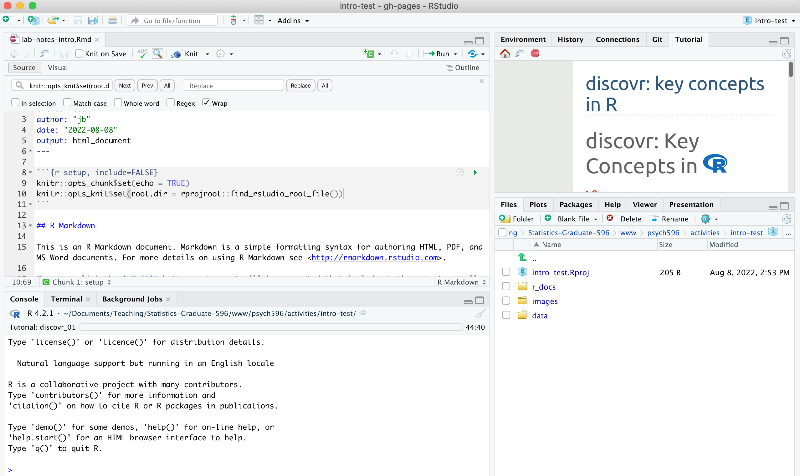
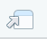

## Week 1 - Set up SPSS & R with RStudio  

*major update August 2025 - [previous version (SPSS via virtual computing, R/RStudio local system install without docker) is here](2024-intro-essentials-instructions-spss-rstudio.html)*  

### 1. Create a local folder for your work in this class  
It can be difficult to manage everybody's individual technology issues, so it's important to make sure we all have similar set ups. Pick a location on your computer's file system, and create a new folder called `psychstats596` - leave it empty for now.   

### 2. SPSS installation/access  

-   If you are a Rutgers student you have access to an SPSS license now (wasn't always the case)! Follow installation and licensing instructions at [https://software.rutgers.edu/product/3880](https://software.rutgers.edu/product/3884) - we will be using version 31 in class. *Note from the Rutgers Software site:
The paperwork for the SPSS renewal is now with the vendor for processing, while we hope it will be completed prior to our expiration date. I can not confirm that.  However, there is a 30-day grace period for SPSS in case the paperwork is delayed past 8/31/2025.*  

### 3. Install R and RStudio (two methods) 

R is a statistical programming language. RStudio is an interactive development environment (IDE) built to make it easier to run, view, and document your work that uses the R language. R and Rstudio are open-source, so you can install them on your own.  

-   if you already have R and Rstudio installed, make sure you have an R version 4 or greater (e.g., 4.0.4 or higher version number), and RStudio 1.4 or greater. Class materials are tested in R version 4.3.3 and RStudio version 2023.12.1+402, with tidyverse version 2.0.0      

    -   to check your R version, run `getRversion()` in the RStudio console  
    -   to check your RStudio version use the RStudio -\> About menu  

If you already have R and RStudio installed, I still recommend running it from a docker container (see below). But if you are happy to manage package versions yourself and troubleshoot any conflicts that arise then I won't stop you.  

#### 3.1 Run Rstudio from a Docker container (recommended)  

One of the biggest challenges in creating reproducable research is that any work you do on a computer (e.g., design, simulation, analysis) relies on the programs and *environment* that are particular to your computer. This means it is not always easy for someone to recreate your work A Docker container basically simulates a whole computing environment on your host computer. In this case I have created a Docker *image* for this class that you can download and run on your own computer. This *image* can be used to run a *container* that has the RStudio environment and most of the pckages you will need for class (I left some packages uninstalled so that you will have some experience installing packages).  
Steps to get a container running:  

-   Download [Docker Desktop](https://www.docker.com/products/docker-desktop/) for your OS (hover over the "Download Docker Desktop" button). Install it (if on windows you can leave unchecked "allow windows containers to be used with this installation"). If on Windows you probably need to restart your computer.  
-   Now, you can pull the Docker *image* for this class and "spin up a container" based on the image. The *image* is called stored on hub.docker.com (the most common location for sharing docker images).    

    1. Launch the Docker Desktop application on your Mac.  
    2. Go to the "Images" Tab. In the Docker Desktop interface, click on the "Images" tab in the left-hand sidebar.  
    3. Search for the Image. In the "Search for images on Docker Hub" field at the top, type the name of the image you want to pull (e.g., nginx or myusername/my-app).  
        - If you are on a mac with a silicon arm64 processor then search for `jamilfelipe/psych596applearm64-rstudio_app`. (to check if you have an arm64 processor, open a terminal and type `uname -m` if the output is `arm64` then it is, otherwise it is an amd64 type chip.  
        - If you are on a computer with a amd64 processor (all others, but talk to me if you are unsure or on a Chromebook), then   search for `jamilfelipe/psych596amd64-rstudio_app`  
    4. Select the Image. From the search results, locate the image you want to pull.  
    5. Pull the Image. Click the "Pull" button next to the desired tag (latest). Docker Desktop will start downloading the image, and you can monitor the progress in the interface.  
    6. Run the image - after it downloads, click "run" (windows) or the triangle "play" (apple) button. This is what is meant by "spinning up a container"    
    7. Click the expand arrow next to "Optional Settings".  
    8. Enter `8787` in the "Host port" text box. This will designate a port number that you will use to access the running container through a web browser (if you have multiple containers running , you will need to use a different port numbers for each).   
    9. Under "Volumes" click the "..." and then select the folder you created earlier. In the "Container path" text box type `/home/rstudio/psychstats596`. Click "Run".  
    10. In the message that comes up, look for "The password is set to ..." and copy the password displayed.  
    11. Now open a web browser and go to `localhost:8787` -- when the username/password box comes up enter `rstudio` for the user, and paste in the password that you copied. You should see the RStudio environment come up in the browser.   

Notes on using containers:  

- once you start a container running it will stay in your "running containers" list in the "Containers" tab in Docker Desktop. Even if you close the Browser window it will still be running in the background.  
- if you encounter problems and want to restart the RStudio session, you can (increasing levels of extremity):  
    - click "Session", "Restart R"  
    - type `quit()` in the console and then click "Start New Session"  
    - click "restart" on the container in Docker Desktop (then note the new password and refresh the browser window)  
    - click the "trash can" icon next to the container to delete it, then spin up a new container from the original image. **you will lose any packages you added in the container you deleted (plus anything you did in the container that wasn't saved within the "mapped" `psychstats596` folder)** -- see [this guide for information about writing a new image with the changes you made in the container](https://www.dataset.com/blog/create-docker-image/)  
- in the RStudio environment, you won't be able to see your whole desktop filesystem, only the folder that you created (and "mapped" into the container as a volume).  
- my standard practice is to just leave a container running indefinitely, closing the browser tab whenever I'm done working for the day and coming back to it each time by opening a new browser. If my computer restarts then I just restart the container through Docker Desktop.  
 
#### 3.2 (do this if you can't or don't want to run Docker) Install R and RStudio, then install packages one by one.

  [Follow instructions here, start at #2](2024-intro-essentials-instructions-spss-rstudio.html)

### 4. Set up your workflow for this week's lab activity  
[This video](http://milton-the-cat.rocks/learnr/r/r_getting_started/#section-working-in-rstudio) (linked in the Syllabus also) describes the workflow that we will use in class. These are the basic steps in the workflow:  
    1. Create a folder containing an RStudio project (`*.Rproj` file) for the lab activity each week. This week, make a folder called "intro-essentials" and then use **File -\> New Project -\> Existing Folder** to create an R project file in the "intro-essentials" folder. Open the project in your current session.    
    2. Inside the folder you made for the project, create new folders called "data", "r\_docs", and "images". You can create the folders through the **Files** tab in the lower right RStudio Pane, or as you normally would in Windows or MacOS.    
    3. Create an **R Markdown file** called "lab-notes-intro" and save it in "r\_docs" folder. Use **File -\>New File -\> R Markdown...** then **Save** (on the RStudio menu). The markdown file will open in the top left RStudio pane - this is where you will write your R code and where you will take notes. When you reach a point where you want to share the document you can use the **Knit** option to generate a report containing your code, notes, and visualizations.  
    4. Delete the template text starting from "## R Markdown" down to the end of the file.  
    5. Write your code inside code "chunks", and run chunks in order when writing/testing code. When you want to generate a report (e.g., an html file that you can share), use the **Knit** button.  
    	    - the start of a chunk is designated by a line that starts with 3 backticks `` ` ``  followed by `{r chunk-name}`. The end of a chunk is designated by a line with 3 backticks.  
    	    - in the "setup" code chunk, add this line to set the working directory ([see here for explanation](https://bookdown.org/yihui/rmarkdown-cookbook/working-directory.html)):  
    	    `knitr::opts_knit$set(root.dir = rprojroot::find_rstudio_root_file())`   
    6. Write your notes above or below code chunks. Characters like \# and \* are used for markdown-style formatting of the report as described [in this pdf](https://www.rstudio.com/wp-content/uploads/2015/02/rmarkdown-cheatsheet.pdf).  

When you have set up your project, your RStudio environment should look something like this:  

### 5. Load the first "learnr" tutorial  

Run this in the Console: `learnr::initialize_tutorial()`  

Go to the Tutorial Pane (top right) and click "start tutorial" for the "learnr: key concepts in R (discovr_01)" tutorial. *it will take a minute or two to load* - use the "pop-out" button  to open the tutorial in a larger view.

-   If you still have time left in class, go through the first section of the Discovr tutorial. It will be helpful to get familiar with the concepts of objects, functions, data types, assignment ("\<-"), and piping ("%\>%").  
-   When you are out of time, save the Markdown file with whatever notes you have (it can be as little as "I was able to save a Markdown file"), and submit that file for the [lab activity assignment](https://rutgers.instructure.com/courses/367674/assignments/3848573)
